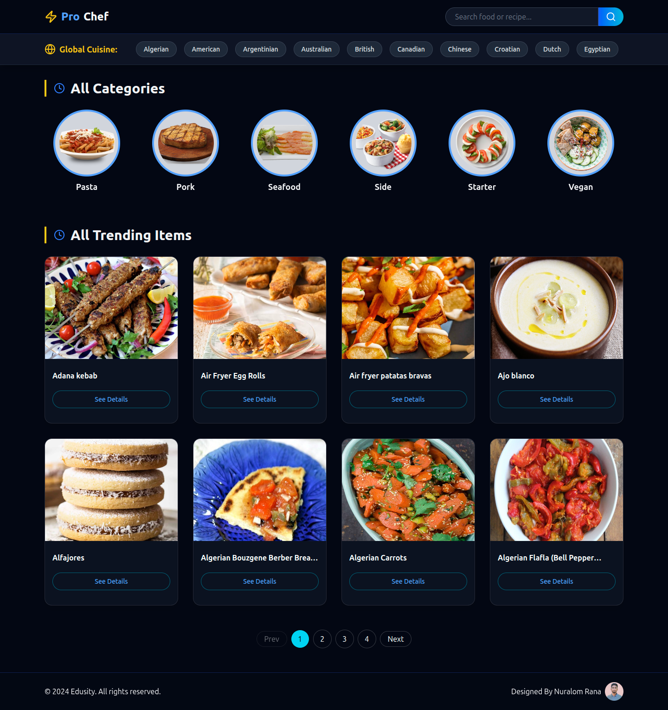
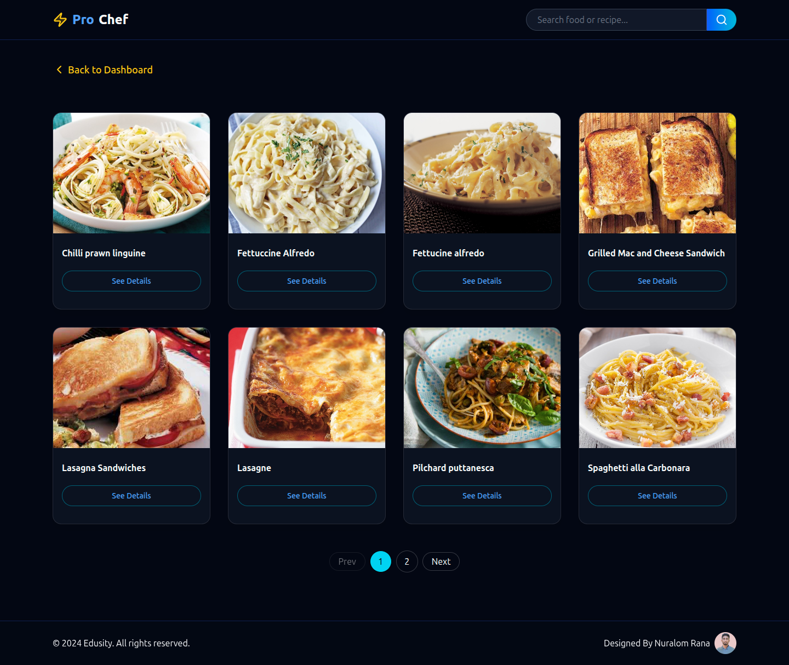
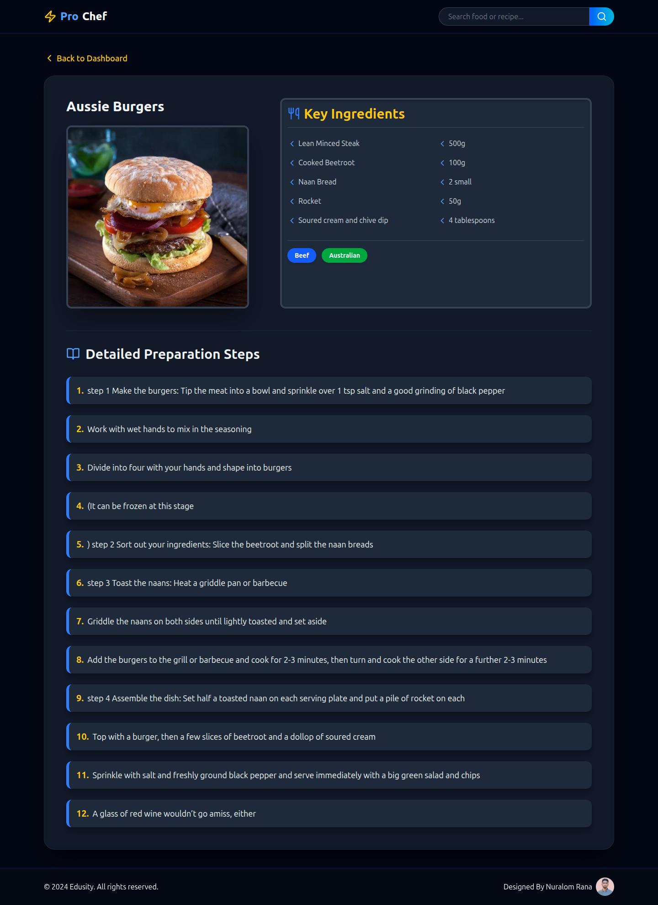

# React + Vite

🍽️ Food Recipe Website (MealDB API)
A modern, responsive Food Recipe Website built with React, powered by the public MealDB API. This project allows users to explore a wide variety of meals, search recipes, browse by category or area, and view detailed cooking instructions through a smooth and user-friendly interface.

🚀 Live Demo:-
🔗 Live Site: https://food-recipe-one-self.vercel.app

✨ Features
🔗 API Integration using Fetch API (MealDB)
🧭 Client-side routing with react-router-dom
🎠 Interactive slider / carousel for categories
⚛️ Modern React Hooks (useState, useEffect, useCallback)
🔍 Search & Filter meals by name, category, and area
📄 Recipe Details Page with instructions and images
📱 Fully responsive design for mobile, tablet, and desktop
⚡ Fast performance with optimized UI

🛠️ Tech Stack:-
React
MealDB API
React Router DOM
Fetch API
Tailwind CSS
Swiper.js (for slider/carousel)
Vite (build tool)
Vercel (deployment)

🌐 API Used:-
MealDB API
https://www.themealdb.com/api.php

📸 Screenshots:-

### 🏠 Home Page

### 🔍 Search Results

### 📄 Recipe Details

📬 Contact:-
If you have any feedback or suggestions, feel free to reach out:
GitHub: https://github.com/coder-nuralom

⭐ If you like this project, don’t forget to star the repository!
